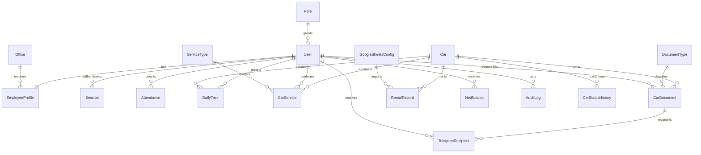

# RentCar architecture — implementation contract

## 1. Application and trust boundaries

Next.js App Router + TypeScript + Tailwind renders the internal dashboard. REST route handlers validate input with Zod, authenticate an opaque database session, and enforce permissions on the server. Modules implement domain operations; Prisma is the repository boundary. PostgreSQL is authoritative. A separate Node worker runs scheduled work and a durable Telegram outbox. Docker separates web, worker and PostgreSQL. No external account is required to use local records.

## 2. ER structure

## 3. Prisma model decisions

The complete executable model contract is `prisma/schema.prisma`. All identifiers are CUIDs; Telegram IDs are strings to avoid integer precision loss. Business dates use PostgreSQL DATE; timestamps use timestamptz. Attendance is unique per employee and submitted local calendar date. Employee-entered local time + validated IANA device timezone is converted to UTC; submission timestamps are stored separately. Late status is based on the entered local time after 10:00, never submission time. Historical Tashkent entries retain their original interpretation through migration 002. Plates have a unique normalized key. Relationships supply employee names and car descriptions rather than copied fields. Rental rows retain external source identifiers; passport data is encrypted at rest and omitted from employee responses. Financial history is not cascade-deleted. Users and cars are deactivated/archived rather than deleting their history.

## 4. Folders

`src/app`: pages and thin API entrypoints; `src/components`: interactive dashboard; `src/lib`: database, validation, auth helpers, time, errors and logging; `src/modules/*`: domain services; `src/worker`: scheduler and delivery; `prisma`: schema, migrations and development seed; `tests`: business/security regression checks; `docs`: architecture and phase ledger.

## 5. Authentication

Login -> distributed database rate limit -> bcrypt compare -> cryptographically random opaque token -> SHA-256 token hash in Session -> HttpOnly SameSite=Lax cookie (Secure in production). Every request rechecks user active status and current role permissions. Unsafe requests require trusted Origin. Password reset/deactivation revokes sessions. Role permissions are data-driven and allow future roles. Authentication providers can later mint the same sessions after verified Telegram authorization.

## 6. Telegram

Domain transaction -> Notification row with deduplication key -> worker claims row -> Telegram Bot API -> SENT or FAILED with exponential retry. Responsible employee/direct document recipient gets expiration messages; office/group recipients get attendance reports. Tokens live only in environment. Admin can link Telegram IDs; `/start` account verification requires an expiring one-use connection token, never a raw employee ID. Delivery is at-least-once: an ambiguous network failure may duplicate a message.

## 7. Sheets

Service-account JWT -> Google access token -> configured sheet range -> validated zero-based column mapping -> normalized plate lookup -> transactional upsert by configured stable source ID -> RentalRecord. Mapping is stored in GoogleSheetsConfig; credentials only in environment. Sync failure leaves previous cache intact. Search uses local records, interval overlap, or exact fine timestamp; sensitive fields require rentals.sensitive permission. Import rejects unknown cars and invalid dates, preventing silent misassignment.

## 8. Scheduler

Dedicated worker polls once per minute. PostgreSQL advisory transaction lock serializes scheduling and date/job keys prevent duplicate daily work. Asia/Tashkent determines business date independently of host timezone. At/after 10:10 attendance report, 08:00 expiration checks, 06:00 Sheets sync, 22:10 missing checkout report. Restart catches up jobs later on the same day. Notification delivery has leased claims, bounded attempts and persisted errors. Run worker separately from web; never register timers inside request handlers.

## Hydration consistency

The server passes one initial date snapshot. Date labels use fixed Uzbek month names and explicit timezone rather than platform-specific ICU locale text. Browser timezone is applied after mount, preserving identical first server/client render. Attendance time inputs use input events supported by WebKit.
